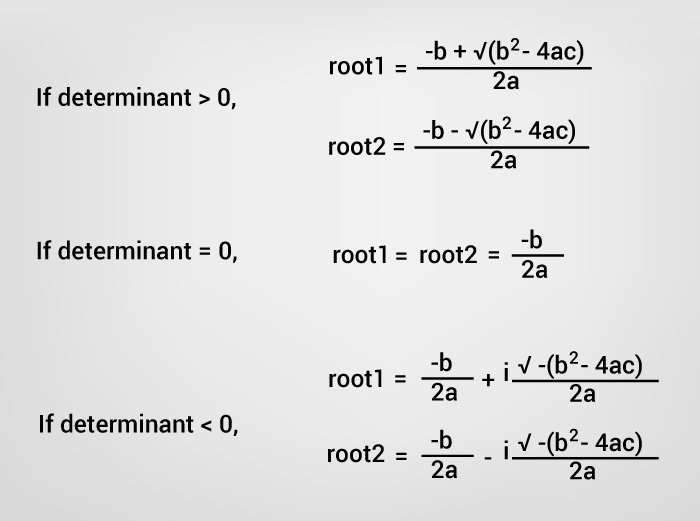

# Roots of a Quadratic Equation

C++ Program to Find All Roots of a Quadratic Equation

This program accepts coefficients of a quadratic equation from the user and displays the roots (both real and complex roots depending upon the discriminant).
For a quadratic equation ax2+bx+c = 0 (where a, b and c are coefficients), it's roots is given by following the formula.

The term b2-4ac is known as the discriminant of a quadratic equation. The discriminant tells the nature of the roots.

If discriminant is greater than 0, the roots are real and different.
If discriminant is equal to 0, the roots are real and equal.
If discriminant is less than 0, the roots are complex and different.

